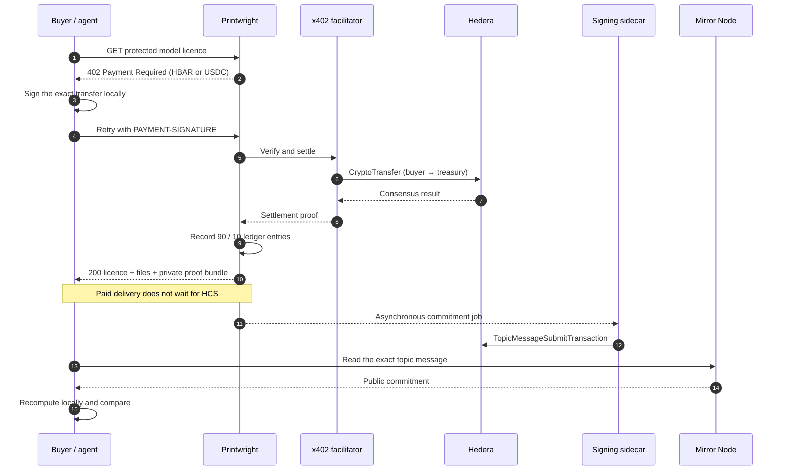
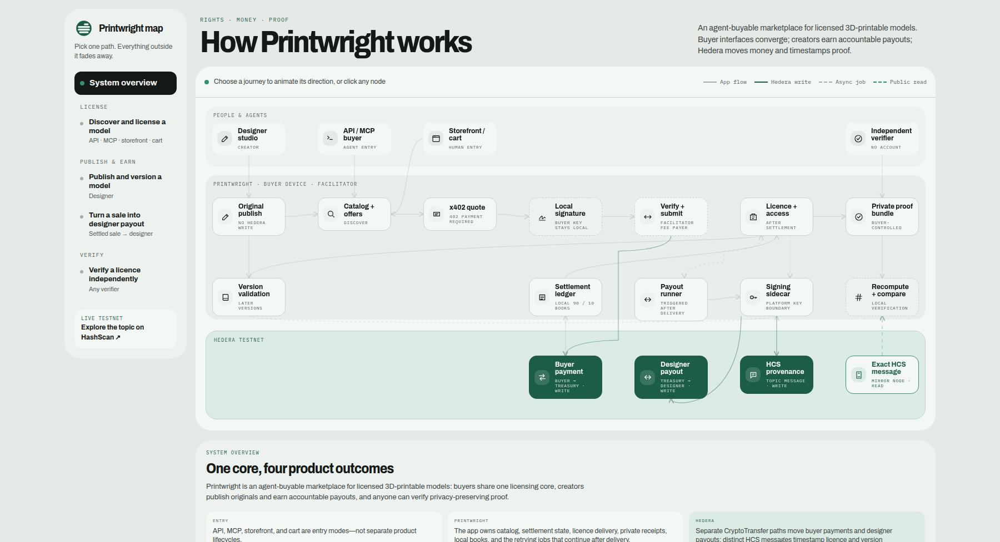

<p align="center">
  
</p>

<h1 align="center">Licensed 3D models that software can buy</h1>

<p align="center">
  Printwright is an agent-buyable marketplace where humans, assistants, and agents
  license printable models through <a href="https://www.x402.org/">x402</a> payments on
  <a href="https://hedera.com/">Hedera</a>.
</p>

<p align="center">
  <a href="https://hedera.com/x402-bounty/"></a>
</p>

<p align="center">
  <a href="#live-testnet-evidence"><strong>On-chain evidence</strong></a> ·
  <a href="#run-the-demo"><strong>Run the demo</strong></a> ·
  <a href="#verify-a-licence-independently"><strong>Verify a licence</strong></a> ·
  <a href="docs/JOURNEYS.md"><strong>Explore the system</strong></a>
</p>

> **Bounty pitch.** Printwright is an agent-buyable marketplace for licensed 3D-printable
> models: APIs, MCP assistants, shopkeeper chat, storefront buyers, and carts all use the same
> licensing core. x402 turns each new licence purchase into an HBAR or USDC payment on Hedera,
> after which Printwright delivers the model and private licence proof while asynchronously
> anchoring an opaque commitment on HCS. Designers receive accountable payouts, and anyone
> holding the proof bundle can recompute it locally and compare it with the exact public
> Mirror Node message.

## Why Printwright

Digital files cannot be made uncopyable. Printwright instead makes the honest path cheap,
machine-payable, and independently provable.

| | What changes |
| --- | --- |
| **Software can buy** | Public API, JavaScript client, MCP tools, and storefront/cart converge on one x402 purchase flow. |
| **Rights match the real use** | Buyers choose a personal licence or one commercial-unit licence for each physical print. |
| **Creators can audit earnings** | Every settled sale records the designer share and platform fee; eligible balances are paid in separate, attributable Hedera transfers. |
| **Proof stays private** | The buyer keeps the certificate, terms, and nonce. Current licence HCS writes contain only an opaque commitment that a disclosed bundle can prove. |

## How one purchase works



The first request discovers the price. The buyer signs locally; Printwright never receives the
buyer key. Only a successful facilitator settlement creates the local books and allows delivery.
Certificate anchoring then retries independently, so a temporary sidecar or HCS failure cannot
turn a paid download into a false failure.

### What a purchase delivers, and how to get it back

The purchase **is** the file. A paid response always carries `files` — one download URL per
printable part — and there is no path on which a settled purchase returns `200` with an empty
list. If the bytes genuinely cannot be served, the response is `503 no_deliverable_file` with the
certificate id and the receipt below; the licence is still issued and the same signed payment
still claims the file once it is back. Payments are final and never refunded, so delivery has to
stay recoverable rather than merely succeeding once.

Those `files` URLs ride a download grant that expires. The durable handle is the **`receipt`
capability** in the same response — a signed token that does not expire and needs no account.
`scripts/buy.mjs` writes the whole paid response to `purchases/<slug>/purchase.json` for exactly
this reason, so the token survives the terminal session (`jq` is used below only to read it):

```bash
cd purchases/cable-clip

# the file list again, with fresh download URLs, months later
curl "$(jq -r .receipt.files_url purchase.json)?token=$(jq -r .receipt.token purchase.json)"

# or go straight to a part (&f=1 for the second part of a multi-part bundle)
curl -L "$(jq -r .receipt.download_url purchase.json)?token=$(jq -r .receipt.token purchase.json)"
```

The same JSON carries the print-feedback and model-update capabilities, and `receipt.url` opens
the human receipt page from the same token. **Store `receipt.token` with the certificate id at
settlement** — it is the one handle that outlives everything else in the response. Buyers keep
access across model versions too: `model_updates` serves the newest deliverable bundle while the
original certified files stay reachable.

Batch responses carry the same `files` and `receipt` per licence, with the bulky proof bundle
fetched from `bundle_url` rather than repeated inline.

### One core, several entry modes

| Entry | Repository path | Role |
| --- | --- | --- |
| **HTTP / JavaScript** | [`client/`](client/) · [`scripts/buy.mjs`](scripts/buy.mjs) | Search, quote, approve, buy, and verify without a Printwright account. |
| **MCP assistant** | [`mcp/`](mcp/) | The same flow as tools with explicit confirmation and a spend ceiling. |
| **Storefront / cart** | Rails UI and batch API | Wallet-approved single purchases or one settlement that fans out to multiple licences. |
| **Shopkeeper chat** | Rails UI and public catalog API | Local keyword search and explicit purchase proposals work without a model-provider key; Gemini adds open-ended recommendations when configured. A separate button still approves and signs. |

## Hedera, exactly

| Operation | Hedera path | Why it exists |
| --- | --- | --- |
| **Buyer payment** | x402 `exact` → HBAR or HTS USDC `CryptoTransfer` | Moves purchase value from the buyer to the treasury with the facilitator as fee payer. |
| **Licence commitment** | HCS `TopicMessageSubmitTransaction` to [`0.0.9585069`](https://hashscan.io/testnet/topic/0.0.9585069) | Timestamps one privacy-preserving commitment after delivery; private certificate contents stay off-chain. |
| **Model provenance** | A separate `pwv-1` HCS message | Commits a validated later model version independently of any purchase. Original publication performs no Hedera write. |
| **Designer payout** | A separate HBAR or USDC `CryptoTransfer` | Moves grouped, eligible earnings from the treasury to a verified designer account. |
| **Public verification** | Mirror Node REST read | Fetches the exact topic sequence for local recomputation and comparison. Mirror Node never writes. |

The Node sidecar is the platform-key boundary for topic creation, HCS submissions, and treasury
payouts. Buyer signing and facilitator fee-payer signing happen outside it.

## Live testnet evidence

These are public records, not screenshots:

| Demonstrated behavior | Evidence |
| --- | --- |
| **2.50 USDC x402 purchase** | [Settlement on HashScan ↗](https://hashscan.io/testnet/transaction/0.0.7162784@1785074352.536547527) |
| **Resulting opaque licence commitment** | [HCS submit on HashScan ↗](https://hashscan.io/testnet/transaction/0.0.9067781@1785074359.768280048) · [exact Mirror message #60](https://testnet.mirrornode.hedera.com/api/v1/topics/0.0.9585069/messages/60) |
| **One 2.60 USDC batch settlement, two licences** | [Settlement on HashScan ↗](https://hashscan.io/testnet/transaction/0.0.7162784@1785074684.046610464) · [HCS #61](https://testnet.mirrornode.hedera.com/api/v1/topics/0.0.9585069/messages/61) · [HCS #62](https://testnet.mirrornode.hedera.com/api/v1/topics/0.0.9585069/messages/62) |
| **Separate designer payout** | [USDC payout on HashScan ↗](https://hashscan.io/testnet/transaction/0.0.9067781@1784242883.124267302) |
| **Separate model-version provenance** | [`pwv-1` submit on HashScan ↗](https://hashscan.io/testnet/transaction/0.0.9067781@1785078563.036978424) · [exact Mirror message #70](https://testnet.mirrornode.hedera.com/api/v1/topics/0.0.9585069/messages/70) |

The dated 2026-07-29 reproducibility snapshot, including a full cold-clone run of every door and
what has and has not been externally validated, is in [`docs/VALIDATION.md`](docs/VALIDATION.md).

## Run the demo

### Zero-funds rehearsal

This exercises the same 402 → approve → settle → deliver contract with conspicuously fake local
payment and topic identifiers. It never returns paid geometry, creates a real licence, or touches
Hedera.

Prerequisites: Ruby 3.3, PostgreSQL 16 with pgvector, Node.js 20+, and OpenSCAD 2021.01+.
(`jq` is only needed for the re-download snippets above.)

```bash
cp .env.example .env
bin/setup --skip-server
bin/rails db:seed
npm install
bin/dev
```

In a second terminal:

```bash
node scripts/buy.mjs --query "cable clip" --sandbox
```

The output shows the raw x402 challenge, the mock payment retry, delivered sandbox receipt,
licence identifier, and locally verifiable sandbox commitment.

The shopkeeper also works without a model-provider key: ask `Find me a cable clip`, then
`Buy the Snap Cable Clip personal license`. That local path is deliberately limited to catalog
search and explicit purchase proposals. Setting `GOOGLE_GENERATIVE_AI_API_KEY` adds open-ended
Gemini recommendations; it is not required for the reproducible chat purchase path.

### Real testnet purchase

With the Rails app and signing sidecar configured from `.env.example` and
`sidecar/.env.example`, fund a buyer through the
[Hedera testnet portal](https://portal.hedera.com/dashboard) and, for USDC, the
[Circle faucet](https://faucet.circle.com). Then run:

```bash
export BUYER_ACCOUNT_ID=0.0.xxxxxxx
export BUYER_PRIVATE_KEY=0x...  # remains in this buyer process
node scripts/buy.mjs --query "cable clip" --asset usdc --max-price 300
```

The script prints the 402 payload, signs locally, retries the protected resource, downloads the
model and proof bundle under `purchases/<slug>/`, and prints the payment and verification links.
Use `--dry-run` to stop after the real 402 without signing or spending.

<details>
<summary><strong>First-time signing-sidecar setup</strong></summary>

```bash
cp sidecar/.env.example sidecar/.env
(cd sidecar && npm install)
(cd sidecar && npm start)
```

In another terminal:

```bash
set -a; source .env; set +a
curl -X POST http://localhost:4021/create-topic \
  -H "Authorization: Bearer $SIDECAR_TOKEN"
```

Copy the returned topic ID to `HEDERA_HCS_TOPIC_ID` in the root `.env`, restart the app and
sidecar, then run the paid buyer command above. The hosted testnet facilitator is the default;
[`selfhost-facilitator/`](selfhost-facilitator/) is the reproducible fallback.

</details>

<details>
<summary><strong>Buying in the browser without a wallet extension</strong></summary>

The storefront cart and the chat approval button both sign through a browser wallet. With
`WALLETCONNECT_PROJECT_ID` set, that is HashPack; without it, checkout says so plainly and
points at the API instead of failing silently. To exercise the browser path with no extension,
run the local demo signer — a separate process that holds only the buyer key, so the marketplace
still never sees it:

```bash
node scripts/demo-wallet.mjs          # signs on :4022
```

Then set `DEMO_WALLET_URL=http://localhost:4022` in the root `.env` and restart the app. The
cart's **Approve cart** button now settles for real on testnet.

Chat purchases are additionally fail-closed: they need both `CHAT_PURCHASES_ENABLED=true` and a
positive `CHAT_MAX_SPEND_CENTS`, and the shopkeeper can only *propose* — the approval button is
the human's, and it is re-priced and cap-checked server-side before anything is signed.

</details>

## Verify a licence independently

The committed proof bundle can be checked without Rails, a Printwright account, or a Printwright
key:

```bash
node verifier/cli.js public/widget-example.bundle.json
```

Expected result:

```text
bundle integrity    VERIFIED
certificate schema  VERIFIED
terms integrity     VERIFIED
Hedera anchoring    VERIFIED
```

The zero-runtime-dependency verifier canonicalizes the private certificate using RFC 8785,
recomputes:

```text
SHA-256("printwright:license-certificate:v1\0" || nonce || JCS(certificate))
```

and compares it with the commitment in the exact HCS message. The proof demonstrates integrity
and consensus timing; it does not independently prove every issuer assertion inside the
certificate.

- CLI/library: [`verifier/`](verifier/)
- Browser widget example (serve `public/` as static files):
  [`public/widget-example.html`](public/widget-example.html)
- Portable sample: [`public/widget-example.bundle.json`](public/widget-example.bundle.json)
- PWC-1 schema: [`public/pwc-1.schema.json`](public/pwc-1.schema.json)

## Architecture

[](docs/JOURNEYS.md)

The compact explanation and evidence links are in [`docs/JOURNEYS.md`](docs/JOURNEYS.md).
The interactive node inspector is [`docs/journey-map.html`](docs/journey-map.html) and can be
opened directly from a local checkout.

| Component | Responsibility |
| --- | --- |
| **Rails 8 application** | Catalog, x402 challenge, facilitator calls, settlement state, licences, private access, receipts, local books, and retrying jobs. |
| **JavaScript client + MCP** | Buyer-side search, approval, local signing, purchase, licence checks, and verification. |
| **Signing sidecar** | Platform-key boundary for HCS writes, topic creation, and treasury payouts. |
| **Standalone verifier** | Local proof-bundle checks plus one public Mirror Node read. |

Developer contracts: [`OpenAPI`](public/openapi.json) · [`llms.txt`](public/llms.txt) ·
[`x402 conformance`](conformance/) · [`operations`](docs/OPERATIONS.md)

<details>
<summary><strong>Tests and quality gates</strong></summary>

```bash
bin/rails test
bin/rails test:system
(cd sidecar && npm test)
(cd client && npm test)
(cd mcp && npm test)
(cd verifier && npm test)
```

GitHub Actions also runs RuboCop, Brakeman, sandbox conformance, seed boot, browser-wallet
contracts, dependency audits, log hygiene, and a repository-wide secret scan.

</details>

## Current scope

- Hedera **testnet**, not mainnet.
- The linked transactions are real testnet payments made during project validation.
- No independent third party has yet purchased from a public deployment; no traction claim is
  made.
- Licences are contractual grants with verifiable commitments, not DRM and not transferable NFTs.

## License

MIT — see [`LICENSE`](LICENSE). Seeded demo models are self-authored, reproducible OpenSCAD
designs dedicated to CC0-1.0; provenance lives in [`db/seed_assets/`](db/seed_assets/).
